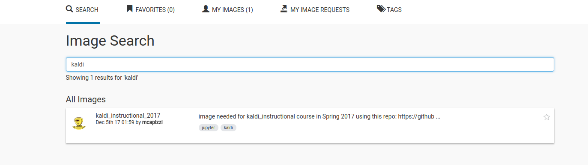
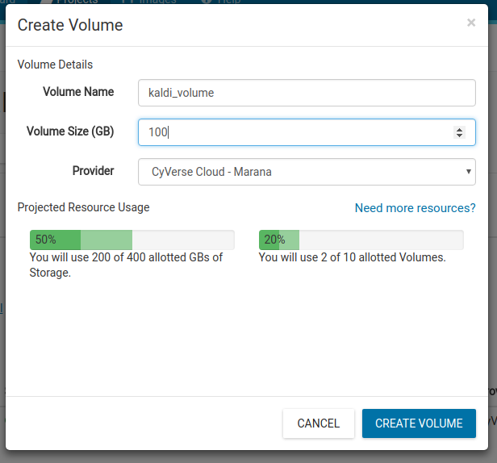
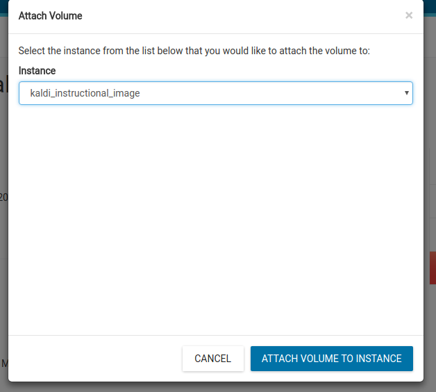

Using Atmosphere
================

Setup of Instance
-----------------

This will give you step-by-step instructions for starting an Atmosphere instance
with the kaldi_instructional resources already loaded.

Go to the cyverse login: [https://user.cyverse.org/services/mine](https://user.cyverse.org/services/mine) and, after logging in, click `LAUNCH` on `Atmosphere`.


You'll arrive at your `Dashboard`.  Here you can see information about your allocations (how much you are using and how much you "have left").  Select `Launch New Instance`.


Enter `kaldi` into the `Image Search`, and select the `kaldi_instructional_2017` image.



You'll see some details about this image.  In the upper right, select `Launch`.


You'll now be asked to set up the instance.
 a. Give an `Instance Name`.
 b. Keep `Base Image Version` at `1.0`.
 c. You may need to name the `Project` (*e.g.* the collection of images and volumes).
 d. Select your `Instance Size`.  The code has been built under the assumption that you will be using `medium2`.  No guarantees can be made that anything smaller will work.  And while you're welcome to choose a larger instance, know that your `Allocation Units` are calculated based on the number of `CPU`s you are running, so you will likely need to `Shutdown` your instance when it's not in use to ensure you don't run our of monthly `Allocation Units`.  

Click `Launch Instance`.
  
 

When your instance is built, you will see it shown with a `Status` of `Active`.  You'll also see an `IP Address` to access the instance.


Setup of Volume (optional)
--------------------------

It's also recommended that you add a `Volume` (*e.g.* external storage drive that is *separate* from your instance) so that you can occasionally backup the files you build throughout the course.  In case of a problem with your instance, you can always start a new instance and transfer those files from the volume.  Click `New-Volume`.


You'll now set up the volume.
  a. Give a `Volume Name`.
  b. Select the `Volume Size`.  `100GB` should be plenty of space, but you are free to choose whatever size fits your needs and current allocations.

Click `Create Volume`
  


You will see that its `Status` is `Unattached`.  Click on the volume link.

Click `Attach`.


You'll be asked to select an instance to attach it to.



Now when you return to your `Project`, you'll see that the `Status` of your volume is `Attached to [instance_name]`.

The volume will be mounted at `/vol_c/` in your instance.

Accessing Instance
------------------

You can now access your image by `ssh`ing into it with the following command:

```
ssh [your_cyverse_id]@[instance_ip]
```

For example:

```
ssh mcapizzi@123.145.125.53
```
However, **if you intend to utilize `jupyter`**, you will need to use the following command:

```
ssh -L [port]:localhost:[port] [your_cyverse_id]@[instance_ip]
```

The *default* port that is used by our scripts is `8880`, and unless you have a reason to change it, that should be used for simplicity.

The command will then look like:

```
ssh -L 8880:localhost:8880 mcapizzi@123.145.125.53
```

If you **do not** add the `-L` argument, you will still be able to access your instance but **not** `jupyter`.
 
**Note:** You'll be asked for a `password`.  This is your `cyverse` account password.

## First Time Access

The `kaldi_instructional_2017` image that you used already has the docker container installed along with all dependencies and compiled `kaldi` code.  

**However**, you **will** need to do a manual `clone` of the repository onto your instance and `checkout` of our branch the **first time** you use your instance.

```
cd /scratch                                                   # the location of storage on the Atmosphere instances
sudo git clone https://github.com/michaelcapizzi/kaldi.git    # clone the repository
cd kaldi                                                      # move into the newly cloned directory 
sudo git fetch                                                # fetch the other repository branches
sudo git checkout kaldi_instructional                         # check out the INSTRUCTIONAL branch
```

Now you can follow the instructions in the main `README` for `Running docker container` and `Running jupyter`.

